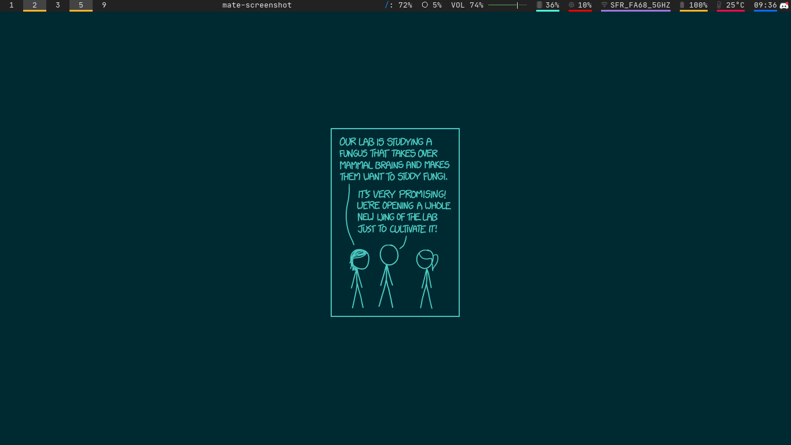

# xkcd-paper.rs

A simple rust program that sets your background to a xkcd using `feh`. 
It gathers background directly from the xkcd API and pre-process it to be a suitable wallpaper.

You can pick how the xkcd is picked (nth/random/last), the background and foreground colors.



## Dependency

- `feh`: An image viewer that  can serv as a wallpaper command

### Compiling Dependency :

- `cargo`: The rust project manager use to build the project

## Install

If you need help to install cargo I'll point you at the [install section of the rust book](https://doc.rust-lang.org/book/ch01-01-installation.html)

```shell
git clone git@github.com:oxabz/xkcd-paper.rs.git      # Cloning the project
sudo apt install feh                                  # or yay -Syu feh
cd xkcd-paper
rustup default stable                                 # Selecting the right toolchain to build the project
cargo install                                         # installing dependency
cargo build --release                                 # Building the project
sudo cp target/release/xkcd_paper /usr/bin/xkcd-paper # Copying the result to bin folder 
```

## Usage

```
Usage: program [-h] [-m random/last/<number>] [-s <width>x<height>] [-p <horizontal>:<height>] [-f RRGGBB] [-b RRGGBB]

Run this program

Options:
    -h, --help          Print the usage menu
    -m, --mode random/last/<number>
                        xkcd selection
    -s, --size <width>x<height>
                        screen size
    -p, --padding <horizontal>:<height>
                        padding around the screen
    -f, --foreground RRGGBB
                        foreground color
    -b, --background RRGGBB
                        background color
```
### Using it with cron
Cron doesnt work straight out with the program.

You can call this small shellscript so that it works with cron
```sh
#!/bin/sh

export HOME=/home/n7student/
export DISPLAY=:0
xkcd-paper
```

### Adapting to the screen size

```bash
#!/bin/bash

export HOME=/home/n7student/
export DISPLAY=:0

connected=$(xrandr | grep " connected ")

margin=20

min_w=99999999
min_h=99999999
max_w=0
max_h=0

re="([0-9]+)x([0-9]+)"

for c in $connected; do
        if [[ $c =~ $re ]]; then
                if [[ ${BASH_REMATCH[1]} -lt $min_w ]]; then
                        min_w=${BASH_REMATCH[1]}
                fi
                if [[ ${BASH_REMATCH[2]} -lt $min_h ]]; then
                        min_h=${BASH_REMATCH[2]}
                fi
                if [[ ${BASH_REMATCH[1]} -gt $max_w ]]; then
                        max_w=${BASH_REMATCH[1]}
                fi
                if [[ ${BASH_REMATCH[2]} -gt $max_h ]]; then
                        max_h=${BASH_REMATCH[2]}
                fi
        fi
done

padding_x=$(($(($max_w-$min_w))/2-margin))
padding_y=$(($(($max_h-$min_h))/2-margin))

xkcd-paper -s "${max_w}x${max_h}" -p "${padding_x}:${padding_y}"
```

## Avenue of improvement

- [ ] Caching the image, so the program can work offline. (Note : I'd currently advice to set a fallback wallpaper before calling the program)
    - [x] Cahching
    - [ ] Retry (Need to figure out how it should look)
- [x] Cleaning up the imports
- [ ] Moving stuff out of the main
- [x] ~Using opengl to avoid the 3 hours runtime~ Used rayon to reduce render time
- [x] Removing the `.replace_err()` and replacing it with `.or(Err())` or making a `or_err()` 
  util
- [ ] making the padding top:bot:left:right rather than horizontal and vertical

